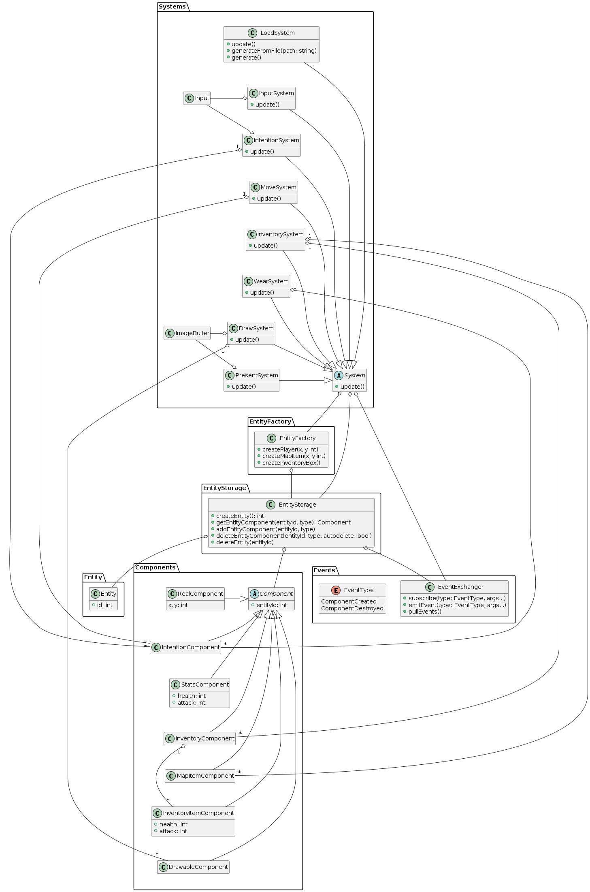

Для создания архитектуры roguelike-игры мы будем использовать шаблон ECS (entity component system), в котором считается, что все объекты в игре относятся к одному из трех видов. Объект Component хранит информацию о компонентах игрового мира (такую, как координаты персонажа, инвентарь и пр.). Объект Entity является контейнером для объектов Component, и позволяет по одному из компонентов находить любой другой компонент, принадлежащий той же Entity. System отвечает за взаимодействие сущностей игры между собой и управление ими.

В главном цикле игры будут последовательно вызываться следующие системы: load_system, input_system, intention_system, move_system, inventory_system, wear_system, draw_system, present_system. Каждая из систем хранит структуру, содержащую все необходимые ей компоненты. Когда система вызывается, она перебирает все компоненты и обновляет их состояние. Помимо этого, есть класс Storage, который хранит новые созданные компоненты. Системы могут обращаться к Storage, чтобы уведомить его о созданных ими компонентах, и чтобы обновить список своих компонент.

Мы будем использовать следующие виды компонент:
1. drawable -- то, что может быть нарисовано, хранит координаты отрисовки и изображение
2. real -- объект игрового мира, хранит координаты
3. input -- компонент, хранящий ввод пользователя
4. intention -- компонент, который имеют сущности, способные откликаться на команды пользователя
5. inventory -- инвентарь персонажа, хранит предметы инвентаря
6. stats -- характеристики персонажа
7. map_item -- предметы, расположенные на карте
8. inventory_item -- предметы, помещенные в инвентарь
9. image_buffer -- буфер с изображением, которое будет отрисовываться

Описание систем, в скобках указаны компоненты, которые хранит каждая система:
1. load_system () -- отвечает за загрузку мира, поддерживает загрузку из файла или генерацию.
2. input_system (input) -- получает ввод с клавиатуры и обновляет внутреннее состоянию с учетом нажатых клавиш.
3. intention_system (input, intention) -- проверяет, какие клавиши были нажаты и выставляет намерения для компонент intention
4. move_system (real) -- перебирает все компоненты real и обновляет их позицию с учетом намерений соответствующих Entity, хранящихся в intention
5. inventory_system (inventory, inventory_item) -- определяет столкновения игрока с предметами на карте, удаляет предметы с карты и помещает их в инвентарь
6. wear_system (intention) -- определяет намерение игрока надеть какую-либо вещь из инвентаря, надевает ее, если есть такая возможность и обновляет характеристики персонажа
7. draw_system (drawable, image_buffer) -- перебирает все компоненты drawable, отрисовывает их в буфере
8. present_system (image_buffer) -- отрисовывает буфер на экране

Сущности и компоненты, которые в них включаются:
1. Персонаж (drawable, real, intention, inventory, stats)
2. Предметы на карте (drawable, real, map_item, inventory_item)
3. Тайлы (drawable, real)
4. Дисплей характеристик персонажа (drawable)
5. Дисплей инвентаря (drawable)

Интерфейсы:
1. Entity: get_component(type)
2. Component: get_entity()
3. System: call()
4. Storage: add_component(comp), get_component(type)

Процесс игры:
есть поле из тайлов (N x N), по которому разбросаны предметы. Персонаж игрока может перемещаться по полю с помощью нажатия клавиш. При соприкосновении игрока с предметом предмет исчезает с карты и появляется в инвентаре. Игрок может переключаться между предметами из инвентаря и надевать их, при этом обновляются его характеристики. Помимо самой карты, на экране отображается инвентарь и характеристики персонажа.

Вопросы:
как происходит удаление одной из Component?

## Architectural drivers

* Roguelike игра.
* Консольная графика.
* Карта мира может как генерироваться, так и загружаться из памяти.

## Роли и случаи использования

Роль - игрок. Сценарий использования - играть в игру.

### Игарть в игру

Игра включает в себя перемещение персонажа по карте, сбор предметов, расположенных на карте, надевание и снятие подобранных предметов.

Сценарий завершается выходом из приложения.

## Типичный пользователь

Типичный пользователь данной консольной игры знаком с жанром игр RogueLike и уверенно пользуется консолью ОС.

# Логическая структура

